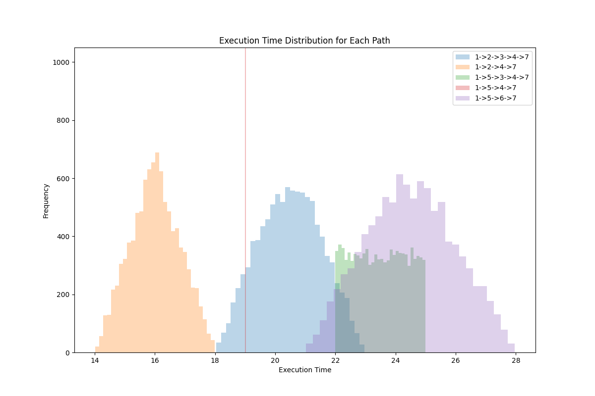
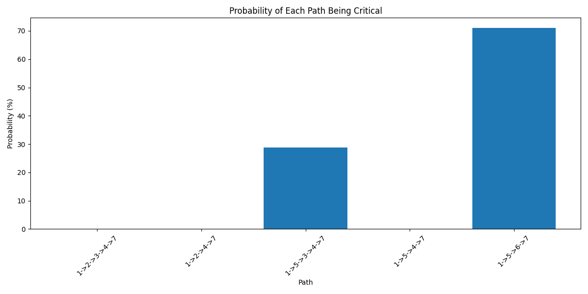

# Software Process Network Performance Analysis

## Project Overview

This project simulates and analyzes a software process network. It uses a simple graph structure to represent connections between different processing nodes, where each edge represents a task with either fixed time or time range. Multiple simulations are performed to evaluate the network performance characteristics.

## Features

- Network model with 7 nodes
- Support for both fixed time and random range task durations
- Execution of 10,000 Monte Carlo simulations
- Performance analysis of all possible paths
- Identification of critical paths and their probabilities
- Generation of visualization charts for analysis

## How to Use

Run the main program to execute the simulation and analysis:

```bash
python main.py
```

The program will generate two analysis charts:
- `path_distributions.png`: Execution time distribution for each path
- `path_criticality.png`: Probability of each path being critical

## Results

Five different network paths were identified through analysis, with two paths significantly impacting system performance:

| Path | Mean Time | Std Dev | Min/Max Time | Critical Path Probability |
|------|-----------|-------------------|--------------|--------------------------|
| 1->5->6->7 | 24.48 | 1.46 | 21.02/27.96 | 71.06% |
| 1->5->3->4->7 | 23.49 | 0.87 | 22.00/25.00 | 28.80% |
| 1->2->3->4->7 | 20.50 | 1.04 | 18.03/22.97 | 0.14% |
| 1->5->4->7 | 19.00 | 0.00 | 19.00/19.00 | 0.00% |
| 1->2->4->7 | 16.01 | 0.81 | 14.02/17.99 | 0.00% |





## Conclusion

This study demonstrates that two paths (1->5->6->7 and 1->5->3->4->7) cause most of the delays in the system. By optimizing these slow paths, especially portions shared by multiple paths, the overall system performance can be improved.

Using the Monte Carlo simulation method provides a comprehensive understanding of system behavior, far beyond simple average case analysis. 